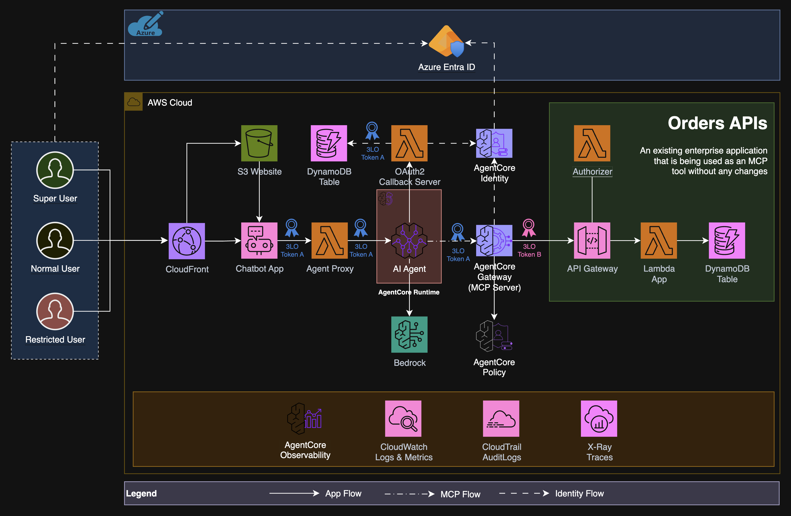

# Secure Agentic App Demo

An end-to-end reference implementation of a secure, agentic application built on AWS. It demonstrates how to integrate a conversational AI agent with enterprise APIs using AWS Bedrock AgentCore, secured with Azure Entra ID (Azure AD) authentication and authorization.

---

## Table of Contents

1. [Project Summary](#project-summary)
2. [Architecture](#architecture)
3. [Project Components](#project-components)
4. [Project Structure](#project-structure)
5. [Prerequisites](#prerequisites)
6. [Infrastructure Code](#infrastructure-code)
7. [AgentCore Policy Engine](#agentcore-policy-engine)
8. [Deploy the Stack](#deploy-the-stack)
9. [Clean Up the Stack](#clean-up-the-stack)
10. [Azure Entra ID Configuration](#azure-entra-id-configuration)
11. [Test Scripts](#test-scripts)

---

## Project Summary

This project demonstrates a production-grade pattern for building secure agentic applications on AWS. A user interacts with a chat frontend, which invokes an AI agent (powered by Strands Agents and Claude Sonnet) via AWS Bedrock AgentCore Runtime. The agent uses the AgentCore Gateway (MCP protocol) to securely call a backend Orders REST API. All components are protected by Azure Entra ID JWT authentication and a 3-legged OAuth2 flow for delegated user access.

**Key capabilities demonstrated:**
- Secure agent-to-API communication via AgentCore Gateway with MCP protocol
- Cedar-based policy engine enforcing fine-grained access control on every gateway request
- 3-legged OAuth2 authorization code flow for user-delegated API access
- JWT-based API Gateway authorization using Azure Entra ID tokens
- CloudFormation-based infrastructure with timestamped deployments for isolation
- Full observability with CloudWatch dashboards and alarms

---

## Architecture



### Architecture flow description

```
┌─────────────────────────────────────────────────────────────────────────────┐
│                              User Browser                                   │
│                    https://<cloudfront-domain>.cloudfront.net               │
└──────────────────────────────────┬──────────────────────────────────────────┘
                                   │ HTTPS (MSAL JWT)
                                   ▼
┌─────────────────────────────────────────────────────────────────────────────┐
│                         CloudFront + S3 (Frontend)                          │
│              Static web app (HTML/JS) with MSAL authentication              │
└──────────────────────────────────┬──────────────────────────────────────────┘
                                   │ POST /invoke (Bearer JWT)
                                   ▼
┌─────────────────────────────────────────────────────────────────────────────┐
│                    HTTP API Gateway → Agent Proxy Lambda                    │
│              Forwards prompt + user token to AgentCore Runtime              │
└──────────────────────────────────┬──────────────────────────────────────────┘
                                   │ InvokeAgentRuntime
                                   ▼
┌─────────────────────────────────────────────────────────────────────────────┐
│                      AWS Bedrock AgentCore Runtime                          │
│           order_agent.py (Strands Agent + Claude Sonnet 4.5)                │
│            Loads MCP tools from Gateway, handles OAuth flow                 │
└──────────────────────────────────┬──────────────────────────────────────────┘
                                   │ MCP (JSON-RPC over HTTPS)
                                   ▼
┌─────────────────────────────────────────────────────────────────────────────┐
│                      AWS Bedrock AgentCore Gateway                          │
│                  Custom JWT authorizer (Azure Entra ID)                     │
│                  OAuth2 credential provider (Microsoft)                     │
│               Gateway Target → Orders API (OpenAPI schema)                  │
│            Cedar Policy Engine (PermitPolicy + ForbidPolicy)                │
└──────────────────────────────────┬──────────────────────────────────────────┘
                                   │ HTTPS (OAuth2 delegated token)
                                   ▼
┌─────────────────────────────────────────────────────────────────────────────┐
│                    API Gateway → Orders API Lambdas                         │
│                get_orders / create_order / update_order                     │
│                 Custom JWT authorizer (Azure Entra ID)                      │
│                       DynamoDB (orders table)                               │
└─────────────────────────────────────────────────────────────────────────────┘

OAuth2 Callback Flow (3-legged):
  AgentCore Runtime ──► OAuth Callback Lambda ──► DynamoDB (token store)
                              │
                              └──► AgentCore Identity API (CompleteResourceTokenAuth)
```

---

## Architecture Explanation

1. **User authenticates** via MSAL in the browser using Azure Entra ID. The frontend obtains a JWT access token.

2. **Frontend sends a prompt** to the Agent Proxy Lambda via the HTTP API Gateway, including the JWT in the `Authorization` header.

3. **Agent Proxy Lambda** forwards the prompt and user token to the AgentCore Runtime via `InvokeAgentRuntime`.

4. **AgentCore Runtime** runs `order_agent.py` — a Strands-based AI agent. On first invocation, it loads available MCP tools from the AgentCore Gateway. For each tool call, it initiates a 3-legged OAuth flow:
   - Stores the user token in DynamoDB via the OAuth Callback Lambda
   - Passes a `customState` CSRF token to the Gateway
   - The Gateway redirects the user to Azure Entra ID for authorization
   - After consent, Azure redirects to the OAuth Callback Lambda
   - The callback retrieves the stored user token and calls `CompleteResourceTokenAuth`

5. **AgentCore Gateway** validates the agent's JWT, evaluates the Cedar policy engine (permit/forbid rules), then calls the Orders API using the delegated OAuth2 token on behalf of the user.

6. **Orders API** validates the delegated token via a custom Lambda authorizer, then reads/writes to DynamoDB.

---

## Project Components

| Component | Technology | Purpose |
|---|---|---|
| **Frontend** | HTML/JS + MSAL | Chat UI with Azure Entra ID authentication |
| **Agent Proxy Lambda** | Python 3.12 | HTTP gateway to AgentCore Runtime |
| **OAuth Callback Lambda** | Python 3.12 | Handles 3-legged OAuth2 callback flow |
| **AgentCore Runtime** | Python 3.12 + Strands | AI agent with MCP tool integration |
| **AgentCore Gateway** | AWS Bedrock AgentCore | MCP gateway with JWT auth + OAuth2 + Cedar policy engine |
| **Orders API** | Python 3.12 + API Gateway | REST API for order management |
| **DynamoDB (orders)** | AWS DynamoDB | Order data storage |
| **DynamoDB (oauth-cb)** | AWS DynamoDB | Temporary OAuth token storage |
| **CloudFront + S3** | AWS CloudFront | Frontend CDN and static hosting |
| **CloudWatch** | AWS CloudWatch | Dashboards, alarms, log metric filters |

---

## Project Structure

```
.
├── ai-agent/
│   └── src/
│       ├── order_agent.py              # AgentCore Runtime entrypoint (Strands agent)
│       ├── lambdas/
│       │   ├── agent_proxy.py          # Agent Proxy Lambda handler
│       │   └── oauth2_callback_server.py  # OAuth Callback Lambda handler
│       ├── lib/                        # Pre-built dependencies (aarch64, Python 3.12)
│       └── requirements.txt
├── backend/
│   └── src/
│       └── lambdas/
│           ├── get_orders.py           # GET /orders Lambda
│           ├── create_order.py         # POST /orders Lambda
│           ├── update_order.py         # PUT /orders Lambda
│           ├── authorizer.py           # JWT authorizer Lambda
│           ├── authorization_policy.py # Authorization policy logic
│           ├── token_validator.py      # JWT validation utilities
│           └── audit_logger.py         # Audit logging utilities
├── frontend/
│   └── src/
│       ├── index.html                  # Main chat UI
│       ├── app.js                      # Frontend application logic
│       ├── auth.js                     # MSAL authentication
│       ├── authConfig.js               # MSAL configuration
│       └── config.generated.js         # Auto-generated config (not committed)
├── infrastructure/
│   └── cloudformation/
│       ├── templates/
│       │   ├── parent.yaml             # Parent stack (orchestrates all child stacks)
│       │   ├── backend-api-stack.yaml  # Orders API infrastructure
│       │   ├── agentcore-app-stack.yaml # AgentCore + Agent App infrastructure
│       │   ├── frontend-stack.yaml     # S3 + CloudFront
│       │   └── monitoring-stack.yaml   # CloudWatch dashboards + alarms
│       ├── agentcore-policy-templates/
│       │   ├── permit-actions.txt      # Reference: Cedar permit policy (allow all gateway calls)
│       │   └── forbid-actions.txt      # Reference: Cedar forbid policy (block qty >= 100)
│       ├── parameters/
│       │   ├── dev-parameters.json     # Dev environment parameters (gitignored)
│       │   ├── staging-parameters.json # Staging parameters (gitignored)
│       │   └── prod-parameters.json    # Production parameters (gitignored)
│       └── scripts/
│           ├── deploy-stack.sh         # Full deployment script
│           ├── cleanup-stack.sh        # Stack deletion script
│           ├── package-lambdas.sh      # Lambda packaging script
│           └── validate-templates.sh   # Template validation script
├── docs/
│   ├── orders-api-openapi-3.0.yaml     # OpenAPI schema for Orders API
│   ├── API_DOCUMENTATION.md
│   ├── AUTHENTICATION_SETUP.md
│   └── MONITORING_AND_ALERTING.md
├── validate_cfn.py                     # Quick CloudFormation template structure validator
└── tests/
    ├── unit/
    │   └── test_agentcore_policy_engine_properties.py  # Property-based tests for Cedar policies
    ├── utils/
    │   ├── test_api_live.sh            # Live API test script
    │   ├── generate_azure_token.sh     # Azure token generation helper
    │   └── setup_test_env.sh           # Test environment setup
    └── integration/
        └── test_api_with_authentication.py
```

---

## Prerequisites

### AWS Account and Permissions

1. **AWS Account** with access to `us-west-2` (or your target region)

2. **AWS CLI** configured with a profile that has these permissions:
   - `cloudformation:*`
   - `iam:CreateRole`, `iam:AttachRolePolicy`, `iam:PassRole`, `iam:PutRolePolicy`
   - `lambda:*`
   - `apigateway:*`
   - `dynamodb:*`
   - `s3:*`
   - `bedrock-agentcore:*`
   - `bedrock-agentcore-control:*`
   - `cloudfront:*`
   - `cloudwatch:*`
   - `logs:*`
   - `secretsmanager:CreateSecret`, `secretsmanager:GetSecretValue`

3. **Two S3 buckets** (create before deploying):
   ```bash
   aws s3 mb s3://your-cfn-templates-bucket --region us-west-2 --no-cli-pager
   aws s3 mb s3://your-lambda-code-bucket --region us-west-2 --no-cli-pager
   ```

4. **Bedrock model access**: Enable `us.anthropic.claude-sonnet-4-5-20250929-v1:0` in the Bedrock console.

5. **Tools required**:
   - AWS CLI v2
   - Python 3.12+
   - `uv` (Python package manager): `pip install uv`
   - Node.js 18+ (for frontend build)
   - `zip` utility

### Azure Entra ID Setup

You need **three Azure App Registrations** in your Azure Entra ID tenant:

#### 1. Gateway App Registration (for AgentCore Gateway JWT auth)
- **Purpose**: The AgentCore Gateway validates JWTs issued for this app
- **Required**: Client ID only (no secret needed)
- **Note the**: Application (client) ID → used as `GatewayIdpClientId`

#### 2. Agent App Registration (for the AI agent)
- **Purpose**: The agent authenticates with this identity
- **Required**: Client ID only
- **Note the**: Application (client) ID → used as `AgentIdpClientId`

#### 3. Orders API App Registration (for the Orders API + OAuth2 flow)
- **Purpose**: Represents the Orders API; also used for OAuth2 delegated access
- **Required**: Client ID + Client Secret
- **Expose an API**: Add scope `/.default`
- **Note the**: Application (client) ID → used as `TargetIdpClientId` and `TokenAudience`
- **Note the**: Client Secret → used as `TargetIdpClientSecret`

#### Common values needed from Azure Portal:
- **Tenant ID**: Azure Portal → Azure Active Directory → Overview → Tenant ID
- **JWKS URL**: `https://login.microsoftonline.com/{tenant-id}/discovery/v2.0/keys`
- **Token Issuer**: `https://login.microsoftonline.com/{tenant-id}/v2.0`
- **IDP Discovery URL**: `https://login.microsoftonline.com/{tenant-id}/v2.0/.well-known/openid-configuration`

---

## Infrastructure Code

The infrastructure is organized as a **parent CloudFormation stack** with 4 nested child stacks:

| Stack | Template | Resources |
|---|---|---|
| **BackendAPIStack** | `backend-api-stack.yaml` | DynamoDB, 4 Lambda functions, API Gateway, JWT authorizer |
| **AgentCoreAppStack** | `agentcore-app-stack.yaml` | AgentCore Gateway, Runtime, OAuth2 provider, Cedar PolicyEngine, PermitPolicy, ForbidPolicy, Agent Proxy Lambda, OAuth Callback Lambda, HTTP API Gateway, DynamoDB (oauth tokens) |
| **FrontendStack** | `frontend-stack.yaml` | S3 bucket, CloudFront distribution, OAC |
| **MonitoringStack** | `monitoring-stack.yaml` | CloudWatch dashboard, 5 alarms, 3 log metric filters |

All stacks accept a `DeploymentSuffix` parameter (format: `yyyymmddHHMM`) that is appended to every named resource, ensuring multiple deployments can coexist in the same account without conflicts.

### Parameter Files

Copy the template and fill in your values:
```bash
cp infrastructure/cloudformation/parameters/dev-parameters.json.template \
   infrastructure/cloudformation/parameters/dev-parameters.json
```

Edit `dev-parameters.json` and replace all `REPLACE_WITH_*` placeholders with your actual values. **This file is gitignored** — never commit it.

---

## AgentCore Policy Engine

The AgentCore Gateway is backed by a **Cedar policy engine** that evaluates every tool call before it reaches the Orders API. Three CloudFormation resources are provisioned in `agentcore-app-stack.yaml`:

| Resource | Type | Purpose |
|---|---|---|
| `PolicyEngine` | `AWS::BedrockAgentCore::PolicyEngine` | Cedar policy engine attached to the gateway in `ENFORCE` mode |
| `PermitPolicy` | `AWS::BedrockAgentCore::Policy` | Allows all principals to call any action on the gateway |
| `ForbidPolicy` | `AWS::BedrockAgentCore::Policy` | Blocks `createOrder` and `updateOrder` requests where `qty >= 100` |

### Policy logic

**PermitPolicy** — broad allow rule:
```cedar
permit (
    principal,
    action,
    resource is AgentCore::Gateway
);
```

**ForbidPolicy** — quantity guard (Cedar `forbid` takes precedence over `permit`):
```cedar
forbid (
    principal,
    action in [
        AgentCore::Action::"<target>___createOrder",
        AgentCore::Action::"<target>___updateOrder"
    ],
    resource == AgentCore::Gateway::"<gateway-arn>"
)
when {
    ((context has input) && ((context.input) has qty)) &&
    (!(((context.input).qty) < 100))
};
```

The `when` clause uses Cedar's safe-navigation semantics — requests without a `qty` field are not affected by the forbid rule.

### Resource naming

Policy resource names follow the pattern `{environment}_{type}_{suffix}` (underscores, no hyphens) to satisfy the AWS name regex `^[A-Za-z][A-Za-z0-9_]*$` and stay within the 48-character limit:

| Resource | Example name |
|---|---|
| PolicyEngine | `dev_orders_gateway_policy_202605100354` |
| PermitPolicy | `dev_permit_orders_policy_202605100354` |
| ForbidPolicy | `dev_forbid_orders_policy_202605100354` |

### Creation order

The policy resources have strict dependency ordering to ensure the Cedar schema is populated before policies are validated:

```
PolicyEngine → AgentCoreGateway → GatewayTarget → PermitPolicy
                                                 → ForbidPolicy
```

### Policy reference files

The Cedar policy statements are embedded directly in the CloudFormation template. The files in `infrastructure/cloudformation/agentcore-policy-templates/` are **reference copies only** — changes there have no effect unless the template is also updated.

### Testing policies

Property-based tests in `tests/unit/test_agentcore_policy_engine_properties.py` validate the Cedar `when` clause logic using the [Hypothesis](https://hypothesis.readthedocs.io/) framework:

```bash
pip install hypothesis
python -m pytest tests/unit/test_agentcore_policy_engine_properties.py -v
```

Five properties are verified across hundreds of generated inputs:
1. ForbidPolicy **blocks** `qty >= 100`
2. ForbidPolicy **permits** `qty < 100`
3. ForbidPolicy **permits** requests with no `qty` field (safe navigation)
4. All resource names fit within the **48-character** AWS limit
5. All resource names match the **AWS name pattern** `^[A-Za-z][A-Za-z0-9_]*$`

### Validating the template structure

`validate_cfn.py` is a quick sanity-check script that parses the CloudFormation template and confirms the `PolicyEngine` resource exists and appears before `AgentCoreGateway` in the resource map:

```bash
python validate_cfn.py
```

---

## Deploy the Stack

### Step 1: Configure parameters

Fill in `infrastructure/cloudformation/parameters/dev-parameters.json` with your Azure Entra ID values and S3 bucket names.

### Step 2: Deploy

```bash
SUFFIX=$(date -u +"%Y%m%d%H%M")

bash infrastructure/cloudformation/scripts/deploy-stack.sh \
  secure-agentcore-app-dev-${SUFFIX} \
  your-cfn-templates-bucket \
  your-lambda-code-bucket \
  --profile your-aws-profile \
  --environment dev \
  --region us-west-2 \
  --suffix ${SUFFIX}
```

The script will:
1. Validate all CloudFormation templates
2. Package all Lambda functions
3. Upload templates, Lambda packages, and OpenAPI schema to S3
4. Deploy the CloudFormation stack (~15-20 minutes)
5. Update the OpenAPI schema with the correct API Gateway ID
6. Refresh the AgentCore Gateway Target
7. Create the gateway secret in Secrets Manager
8. Warm up the AgentCore Runtime
9. Build and upload the frontend to S3
10. Invalidate the CloudFront cache

**Options:**
```
--dry-run       Preview changes without deploying
--no-rollback   Keep failed stacks for debugging (use with --no-rollback)
--suffix        Explicit timestamp suffix (auto-generated if omitted)
```

### Step 2: Post-deployment — Update Azure Entra ID

See [Azure Entra ID Configuration](#azure-entra-id-configuration) below.

---

## Clean Up the Stack

```bash
bash infrastructure/cloudformation/scripts/cleanup-stack.sh \
  secure-agentcore-app-dev-202605051633 \
  --profile your-aws-profile \
  --region us-west-2
```

Type `DELETE` when prompted to confirm. Use `--force` to skip the prompt.

The script automatically empties the versioned S3 bucket before deletion to prevent `BucketNotEmpty` errors.

---

## Azure Entra ID Configuration

After deploying the stack, retrieve the required URLs from the stack outputs:

```bash
aws cloudformation describe-stacks \
  --stack-name secure-agentcore-app-dev-<suffix> \
  --profile your-aws-profile \
  --region us-west-2 \
  --no-cli-pager \
  --query 'Stacks[0].Outputs[*].[OutputKey,OutputValue]' \
  --output table
```

Note these values:
- `CloudFrontDomainName` → e.g. `d1xukfr61eh0xg.cloudfront.net`
- `CallbackUrl` → AgentCore Identity callback URL (e.g. `https://bedrock-agentcore.us-west-2.amazonaws.com/identities/oauth2/callback/...`)

### 1. Update the Gateway App Registration (AgentCore Gateway JWT auth)

In Azure Portal → App Registrations → **Gateway App** (`GatewayIdpClientId`):

1. Go to **Authentication**
2. Under **Single-page application** or **Web**, add a Redirect URI:
   ```
   https://<CloudFrontDomainName>
   ```
   This allows the frontend to authenticate and obtain tokens for the gateway audience.

### 2. Update the Orders API App Registration (AgentCore Identity callback)

In Azure Portal → App Registrations → **Orders API App** (`TargetIdpClientId`):

1. Go to **Authentication**
2. Under **Web**, add a Redirect URI:
   ```
   <CallbackUrl>
   ```
   This is the AgentCore Identity service callback URL that completes the 3-legged OAuth2 flow when a user authorizes the agent to access the Orders API on their behalf.

---

## Test Scripts

### 1. Live API Test (`tests/utils/test_api_live.sh`)

Tests the Orders API end-to-end with real Azure Entra ID tokens.

```bash
# Set your Azure token first
export AZURE_TOKEN=$(bash tests/utils/generate_azure_token.sh)

# Run the tests
bash tests/utils/test_api_live.sh
```

The script will prompt for the stack name (default: `secure-agentcore-app`), then run 8 tests covering:
- Unauthenticated access (expects 401)
- Invalid/expired tokens (expects 403)
- Unauthorized users (expects 403)
- Authorized GET, POST, PUT operations (expects 200/201)

### 2. Generate Azure Token (`tests/utils/generate_azure_token.sh`)

Generates an Azure Entra ID access token for testing.

```bash
export AZURE_TOKEN=$(bash tests/utils/generate_azure_token.sh)
echo "Token: ${AZURE_TOKEN:0:50}..."
```

### 3. Setup Test Environment (`tests/utils/setup_test_env.sh`)

Sets up environment variables needed for testing.

```bash
source tests/utils/setup_test_env.sh
```

### 4. Integration Tests (`tests/integration/test_api_with_authentication.py`)

Python-based integration tests for the Orders API.

```bash
cd tests/integration
python test_api_with_authentication.py
```

### 5. Template Validation (`infrastructure/cloudformation/scripts/validate-templates.sh`)

Validates all CloudFormation templates using AWS CLI and cfn-lint.

```bash
bash infrastructure/cloudformation/scripts/validate-templates.sh
```

---

## Important Notes

- **Parameter files are gitignored** — never commit `dev-parameters.json`, `staging-parameters.json`, or `prod-parameters.json` as they contain secrets.
- **Each deployment gets a unique suffix** — use the same suffix for cleanup as was used for deployment.
- **The `ai-agent/src/lib/` directory** contains pre-compiled `aarch64` Python 3.12 binaries for the AgentCore Runtime. The deploy script always runs `uv pip install -r requirements.txt` on top of `lib/` at package time, so newly added dependencies (like `strands-agents-tools`) are automatically included without needing to rebuild `lib/` from scratch. Only rebuild `lib/` manually when upgrading the pinned versions of heavy packages:
  ```bash
  rm -rf ai-agent/src/lib && mkdir -p ai-agent/src/lib
  uv pip install \
    --python-platform aarch64-manylinux2014 \
    --python-version 3.12 \
    --target=ai-agent/src/lib \
    --only-binary=:all: \
    -r ai-agent/src/requirements.txt
  ```
- **The OpenAPI schema** (`docs/orders-api-openapi-3.0.yaml`) contains a placeholder API Gateway ID that is automatically replaced during deployment.
- **Gateway secret** (`${environment}-gateway-secret-${suffix}`) is created automatically by the deploy script and contains the Azure credentials needed by the agent for client-credentials OAuth flow fallback.
